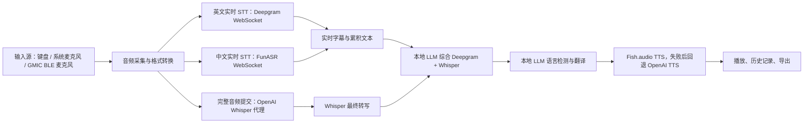
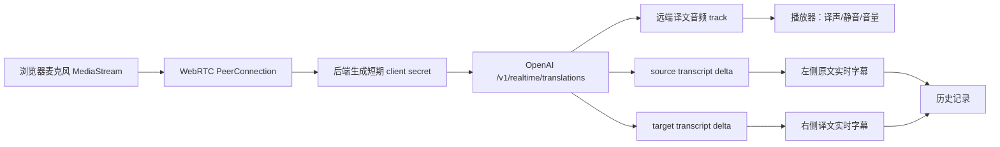
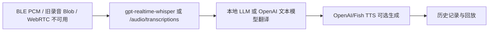

# OpenAI 实时转写与翻译流程改造计划

日期：2026-05-10  
项目目录：`C:\n8n\mdemos\ngnix\html`  
核心文件：`trans.html`、`..\..\translation-service-deploy-ready\api-proxy\server.js`、`..\nginx.conf`

## 1. 当前代码的“中间意义”

当前 `trans.html` 不是单纯的“文本翻译页”，而是一个把多路语音输入、实时转写、最终校正、翻译、TTS、历史记录和蓝牙麦克风控制揉在一起的浏览器端语音翻译控制台。

它当前的主流程可以理解为：

关键模块含义：

- `startRecording()`：根据 `mainLanguage` 选择 Deepgram 或 FunASR，负责系统麦克风录音生命周期。
- `initDeepgramRecognizer()`：浏览器采集 PCM16，直连 Deepgram WebSocket，做英文实时转写。
- `initFunASRRecognizer()`：浏览器采集 PCM16，经 `/funasr-ws/stream` 代理到本地 FunASR，做中文实时转写。
- `sendToWhisper()`：录音结束后把完整音频通过 `/api-proxy/api/openai/whisper` 送到 OpenAI Audio Transcriptions，拿最终文本。
- `combineTranscriptionsWithChatGPT()`：用本地 LLM 把实时转写和 Whisper 最终转写合并。
- `handleInput()`：语言检测、决定翻译方向、调用 `translateByChatGPT()`，再调用 TTS 和历史记录。
- `translateByChatGPT()` / `callLocalLLM()`：走 `/local-llm/v1/chat/completions`，实际转发到 192.168.1.41 的 LM Studio。
- `speakTextByTTS()`：优先 Fish.audio，失败后 OpenAI TTS。
- `SegmentProcessor` / `StreamingTranslationController`：尝试做分段低延迟 TTS，但与 turn-based 逻辑并存，状态复杂。
- BLE 部分：处理 GMIC 麦克风连接、ADPCM 解码、物理按钮事件、PCM 缓冲和分段提交。

当前架构的价值：

- 已经支持系统麦克风、BLE 麦克风、文本输入三类入口。
- 已经有本地 LLM、OpenAI、FunASR、Fish.audio 多供应商 fallback 能力。
- 已经有历史记录、TTS 播放、语速控制、导出记录等面向实际演示的功能。

当前主要问题：

- 语音链路被拆成 STT -> 文本翻译 -> TTS 三段，延迟天然偏高，说话自然性差。
- 英文、中文路径分裂：EN 走 Deepgram，ZH 走 FunASR，最终又回到 Whisper/LLM/TTS，状态同步困难。
- API Key 有前端暴露问题，尤其 Deepgram 和 Fish.audio。
- `trans.html` 单文件接近 170KB，状态变量和职责高度耦合，继续加新引擎会更脆。
- 失败状态对用户不透明，翻译失败可能写入空历史。

## 2. OpenAI 当前能力核对

以下为 2026-05-10 通过 OpenAI 官方文档核对的信息：

- `gpt-realtime-translate` 是专用“流式语音到语音翻译”模型，输入音频，输出翻译音频和文本增量；官方说明它连接专用 `/v1/realtime/translations` 端点，按音频时长计费，价格为 `$0.034 / minute`。来源：OpenAI `gpt-realtime-translate` 模型页与 Realtime translation 指南。
- `gpt-realtime-whisper` 是专用实时 STT 模型，适合低延迟 transcript deltas，价格为 `$0.017 / minute`。来源：OpenAI `gpt-realtime-whisper` 模型页与 Realtime transcription 指南。
- `gpt-realtime-2` 是更完整的实时语音交互模型，适合需要助手推理、工具调用、复杂会话控制的场景；音频输入 `$32 / 1M audio tokens`，音频输出 `$64 / 1M audio tokens`。来源：OpenAI `gpt-realtime-2` 模型页。
- OpenAI 推荐浏览器音频场景使用 WebRTC，并且标准 API Key 必须留在后端，由后端生成短期 client secret 或统一接口会话。来源：Realtime WebRTC 指南。
- OpenAI 的 Realtime translation 指南明确区分“翻译会话”和“语音助手会话”：翻译会话是 interpreter，不需要 `response.create`，持续输入音频，持续输出 translated audio + transcript deltas。

参考链接：

- https://developers.openai.com/api/docs/models/gpt-realtime-translate
- https://developers.openai.com/api/docs/guides/realtime-translation
- https://developers.openai.com/api/docs/models/gpt-realtime-whisper
- https://developers.openai.com/api/docs/guides/realtime-transcription
- https://developers.openai.com/api/docs/models/gpt-realtime-2
- https://developers.openai.com/api/docs/guides/realtime-webrtc
- https://developers.openai.com/api/docs/pricing

## 3. 推荐改造目标

目标不是简单替换 `whisper-1`，而是把现在的“多段拼接翻译”改造成“实时翻译主链路 + 转写/文本 fallback”的双轨系统。

建议目标：

1. 主链路：系统麦克风使用 `gpt-realtime-translate` WebRTC，实现边说边出目标语音和字幕。
2. 字幕链路：同步展示 source transcript delta 与 target transcript delta。
3. fallback 链路：网络不稳、模型不可用或 BLE 输入时，退回 `gpt-realtime-whisper` 或现有 Whisper + 本地 LLM。
4. 安全链路：所有 OpenAI、Fish、Deepgram 等标准 API Key 全部后端化，前端只拿短期 client secret。
5. 代码结构：把 `trans.html` 拆成小模块，避免继续堆在一个巨型脚本里。

## 4. 三种改造路线

### 路线 A：最小替换，保留旧链路

做法：

- 保留现有 UI 和大部分逻辑。
- 把 `/api/openai/whisper` 默认模型从 `whisper-1` 改为 `gpt-4o-mini-transcribe` 或 `gpt-4o-transcribe`。
- 增加 `/api/openai/realtime-transcription-session`，用于试验 `gpt-realtime-whisper`。
- 暂时保留 Deepgram、FunASR、Fish.audio。

优点：

- 改动最小，风险低。
- BLE 录音和历史记录基本不用动。
- 可快速验证 OpenAI 新 STT 的准确率和成本。

缺点：

- 仍然是 STT -> 翻译 -> TTS 三段式，不会根本改善自然性。
- 多供应商复杂度仍在。
- 前端状态膨胀问题没有解决。

适合：先做一周内的技术验证。

### 路线 B：推荐路线，OpenAI 实时翻译作为主链路

做法：

- 新增后端接口 `/api/openai/realtime-translation-session`，由后端调用 OpenAI `/v1/realtime/translations/client_secrets`，返回短期 secret。
- 前端新增 `OpenAIRealtimeTranslator` 模块，用 WebRTC 接入 `gpt-realtime-translate`。
- UI 从“录音后翻译”变为“实时口译”：开始、暂停、静音原声、播放译声、显示原文字幕、显示译文字幕。
- 保留现有 Whisper + local LLM 作为 fallback 和 BLE 离线模式。
- 逐步移除 Deepgram/Fish 明文 Key，Fish TTS 只作为非实时历史重播或自定义音色 fallback。

优点：

- 自然性提升最大：音频持续输入，翻译音频和字幕持续输出。
- 架构变简单：主路径由一个专用翻译会话负责，不再多段拼接。
- 成本更可控：`gpt-realtime-translate` 按分钟计费，约 `$2.04 / hour`。
- 前端安全显著提升：标准 OpenAI Key 不进入浏览器。

缺点：

- 需要新增后端 session 接口和前端 WebRTC 状态机。
- BLE 麦克风如果不能直接作为浏览器 MediaStream，需要先保留旧 PCM/WebSocket fallback。
- 专用翻译模型不支持工具调用；如果要“助手式解释/追问”，需要另接 `gpt-realtime-2`。

适合：你真正想改善“语言翻译自然度”的主方向。

### 路线 C：双引擎专业版

做法：

- 实时口译使用 `gpt-realtime-translate`。
- 对话助手/术语解释/业务上下文判断使用 `gpt-realtime-2` 或文本模型。
- 转写归档使用 `gpt-realtime-whisper` 或 `gpt-4o-transcribe`。
- BLE 麦克风通过后端媒体 worker 转 WebSocket，统一进 OpenAI realtime translation。

优点：

- 能同时覆盖实时口译、会议记录、业务术语、复盘总结。
- 可为 FleetMic / OpsMic / ClinMic 复用成通用语音中台。

缺点：

- 成本、实现、测试复杂度最高。
- 需要明确产品边界，否则会重新变成多链路混杂。

适合：在路线 B 验证成功后做产品化。

## 5. 推荐方案

建议采用路线 B：`gpt-realtime-translate` 作为主翻译链路，现有链路降级为 fallback。

新的主流程：

保留 fallback：

## 6. 预期提升

### 自然度

当前用户体验是“先录音、等转写、等翻译、等 TTS”。改造后变成“说话时持续输出译声和字幕”。这会显著降低口译停顿感，尤其适合真实对话。

### 延迟

当前路径至少包含多个串行阶段：STT、最终 Whisper、LLM 翻译、TTS。新主链路把实时翻译和译声合并在一个翻译会话里，减少中间等待。

### 成本

按官方价格，`gpt-realtime-translate` 为 `$0.034 / minute`，约 `$2.04 / hour`。如果只是实时转写，`gpt-realtime-whisper` 为 `$0.017 / minute`，约 `$1.02 / hour`。普通批量转写仍可用 `gpt-4o-mini-transcribe`，官方估算 `$0.003 / minute`，约 `$0.18 / hour`。

### 安全

标准 API Key 放回后端，前端只拿短期 client secret，能解决当前 Deepgram/Fish Key 明文暴露的同类问题。

### 可维护性

把 `trans.html` 拆成模块后，状态边界更清晰：

- `audio-capture.js`：麦克风、BLE、PCM 转换。
- `openai-realtime-translation.js`：WebRTC translation session。
- `fallback-transcription.js`：Whisper / realtime whisper fallback。
- `translation-state.js`：语言方向、会话状态、错误状态。
- `history-store.js`：localStorage 历史。
- `ui-bindings.js`：DOM 事件与界面更新。

## 7. SWOT

### Strengths 优势

- OpenAI 专用实时翻译模型能直接输出译文音频和字幕，正好匹配你的“更自然语言翻译”目标。
- 现有项目已经有 nginx、api-proxy、OpenAI API Key 环境变量、音频采集、历史记录，迁移基础不错。
- `gpt-realtime-translate` 按分钟计费，成本模型比多段 token/TTS 混合计费更容易估算。
- 保留旧 fallback 后，迁移可以渐进，不需要一次性废掉 Deepgram/FunASR/Whisper。

### Weaknesses 劣势

- 当前 `trans.html` 太大，直接塞 WebRTC 会让复杂度继续上升，必须先模块化。
- BLE 麦克风不是标准浏览器 MediaStream，不能直接走最顺滑的 WebRTC 路线，可能仍需 server-side WebSocket/PCM 桥接。
- 实时翻译模型是 interpreter，不是完整 agent；如果需要业务对话、工具调用、术语库动态检索，需要另接模型或后端逻辑。
- 当前错误处理和状态恢复较弱，实时链路会放大断线、权限、设备切换等问题。

### Opportunities 机会

- 可以把翻译页升级成 GMIC 麦克风的核心演示：实时双语字幕 + 译声播放 + 录音归档。
- 可形成通用语音中台，复用到 FleetMic、OpsMic、ClinMic 场景。
- 后续能加入术语表、行业词库、说话人方向识别、会议纪要、双语摘要。
- 价格下降后，实时翻译从“演示功能”变成“可长时间使用的产品功能”。

### Threats 风险

- Realtime translation 对网络抖动、浏览器音频权限、WebRTC 兼容性更敏感。
- OpenAI 专用翻译模型的语言对、口音、专有名词表现需要实测，不能只看文档决策。
- 如果不立即处理前端 Key 暴露，旧供应商 Key 仍有滥用风险。
- 多模型并存期间如果没有清晰开关，用户会遇到“有时实时、有时录后翻译”的体验不一致。

## 8. 分阶段改造计划

### Phase 0：安全和基础修复

目标：先停止已知风险，确保页面初始化稳定。

- 修复 `initializeDefaults()` 访问不存在 DOM 的错误。
- 移除前端 Deepgram/Fish API Key，至少先改为后端代理或禁用旧直连。
- 给翻译失败、TTS 失败、连接失败增加可见错误提示。
- 明确入口为 `https://xcu.ai/trans.html`。

验收：

- 页面加载无控制台初始化错误。
- 前端源码不再包含标准供应商 API Key。
- 后端健康检查能明确显示 OpenAI realtime session 能力。

### Phase 1：OpenAI realtime translation POC

目标：验证自然度、延迟、成本。

- 在 `api-proxy/server.js` 增加 `/api/openai/realtime-translation/session`。
- 后端使用 `OPENAI_API_KEY` 调 OpenAI client secret 接口。
- 前端新增独立 POC 页面或模块，不先改完整旧页面。
- 使用系统麦克风 WebRTC 连接 `gpt-realtime-translate`。
- 展示原文字幕、译文字幕、播放译声。

验收：

- EN -> ZH、ZH -> EN 都能实时输出字幕和译声。
- 记录 first translated audio latency、end-of-utterance latency。
- 连续 10 分钟会话不断线，断线可重连。

### Phase 2：主页面集成

目标：把实时翻译变成默认体验。

- UI 增加模式切换：`实时口译`、`录后翻译`、`仅转写`。
- 默认系统麦克风走 `gpt-realtime-translate`。
- 旧 `Record` 逻辑降级为 fallback。
- 历史记录从“单次原文/译文”升级为“会话片段流”。
- 播放器支持译声音量、原声监听、字幕开关。

验收：

- 普通用户点击一次即可开始实时口译。
- 断线、权限拒绝、模型不可用都有 UI 状态。
- 历史记录能保存原文/译文片段和时间戳。

### Phase 3：BLE 麦克风适配

目标：让 GMIC-MIC01/02 也能进入新链路。

两种路径：

- 短期：BLE 仍走旧 ADPCM -> PCM -> Whisper/local LLM fallback。
- 中期：浏览器把 BLE PCM 通过 WebSocket 发给后端 media worker，后端转发到 OpenAI realtime translation WebSocket。

验收：

- BLE 物理按钮启动/停止仍可用。
- BLE 音频能够产生实时字幕或准实时翻译。
- 不影响系统麦克风 WebRTC 主链路。

### Phase 4：质量评估与产品化

目标：决定是否彻底替换旧供应商。

- 建立双语测试集：人名、公司名、地址、数字、金额、口音、快语速、混合中英。
- 记录延迟、准确率、漏译、错译、音色稳定性。
- 与旧 Deepgram/FunASR/Whisper/local LLM 链路并排 A/B。
- 根据结果决定是否移除 Deepgram、Fish.audio、FunASR 依赖。

验收：

- 有一份真实样本评估表。
- 有明确保留/移除供应商决策。
- 有上线回滚开关。

## 9. 建议的下一步决策

我建议下一步先做 Phase 0 + Phase 1，不动 BLE 主逻辑，不大改历史记录。先用系统麦克风跑通 `gpt-realtime-translate` POC，拿真实延迟和翻译质量样本后，再决定是否进入主页面集成。

决策点：

1. 是否把 `gpt-realtime-translate` 作为默认主链路？
2. 是否保留 FunASR 作为中文本地 fallback？
3. 是否继续保留 Fish.audio 作为历史回放 TTS，还是全面换 OpenAI 音频输出？
4. BLE 麦克风第一阶段是否只保留旧 fallback，不强行接 realtime translation？

我的建议：

- 默认主链路：是，使用 `gpt-realtime-translate`。
- FunASR：短期保留，作为离线/内网 fallback。
- Fish.audio：先移除前端 Key，短期通过后端代理保留，长期视音色质量决定。
- BLE：第一阶段不要硬接 WebRTC，先保留旧链路；等系统麦克风验证成功后再做后端媒体桥。
