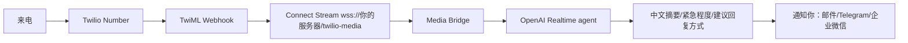
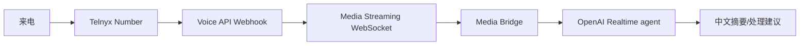

# 下一步远程体验与电话接入路线

日期：2026-05-12  
项目：`https://github.com/xtrigg/trans`

## 目标

你现在有两个短期目标：

1. 尽快在远程 HTTPS 地址上体验实时翻译，用于家长会、客户沟通等面对面或线上会议场景。
2. 评估把手机号接到电话平台，再接入实时语音引擎，让系统先接电话、翻译成中文、判断是否需要你回电话或改用邮件处理。

结论：先做“远程浏览器实时翻译”，再做“测试号码电话代理”，最后再考虑把你的真实主手机号迁移或转接进去。不要一上来 port 主号码。

## 当前技术状态

已完成：

- 代码已在 GitHub：`https://github.com/xtrigg/trans`
- `main` 已包含 Phase 0 + Phase 1。
- 后端已有 OpenAI Realtime Translation session 端点。
- 前端已有 POC 页面：`public/realtime-translation-poc.html`
- 本地启动 `api-proxy` 后可以打开：`http://127.0.0.1:3010/realtime-translation-poc.html`

缺口：

- 还没有部署到公网 HTTPS 域名。
- 还没有配置生产 `OPENAI_API_KEY`。
- 还没有用真实 OpenAI Realtime Translation 做 EN->ZH / ZH->EN 的现场测试。
- 还没有电话平台号码、Webhook、Media Stream、来电摘要和通知链路。

## 第一阶段：先把远程实时翻译跑起来

### 你需要准备

- 一个 OpenAI API Key，放在服务器 `.env`，不要放前端。
- 一个 HTTPS 域名。建议先用现有 `xcu.ai` 或子路径，例如：
  - `https://xcu.ai/trans/`
  - `https://xcu.ai/trans/realtime-translation-poc.html`
- 一个能跑 Docker 的部署环境。现有 nginx + Docker 环境可以复用。

### 推荐部署方式

复用当前 `xcu.ai` 的 nginx 和 Docker：

1. 在服务器或当前 Docker 主机拉取仓库：

```bash
git clone https://github.com/xtrigg/trans.git
cd trans
```

2. 写 `.env`：

```bash
OPENAI_API_KEY=你的OpenAI Key
AZURE_TTS_KEY=
AZURE_SPEECH_KEY=
AZURE_SPEECH_REGION=westus
PORT=3010
```

3. 启动 api-proxy：

```bash
docker compose up -d --build api-proxy
```

4. nginx 暴露静态页面和 `/api-proxy/`：

- 静态页面指向 `trans/public/`
- `/api-proxy/` 转发到 api-proxy 的 `3010`
- 必须是 HTTPS，因为浏览器麦克风和 WebRTC 在远程地址上需要安全上下文。

5. 打开：

```text
https://xcu.ai/trans/realtime-translation-poc.html
```

### 远程体验验收

必须实际测 4 件事：

- 浏览器能打开 POC 页面。
- 点击 Start 后能申请麦克风权限。
- EN -> ZH 能输出译文字幕和译声。
- ZH -> EN 能输出译文字幕和译声。

记录：

- 首包译声延迟。
- 字幕是否连续。
- 专有名词、人名、学校名、客户名是否准确。
- 长时间会议是否稳定，先测 10 分钟，再测 30 分钟。

## 第二阶段：家长会/客户沟通怎么用

### 家长会

建议使用方式：

- 用手机或笔记本打开远程 POC。
- Source 选对方语言，Target 选中文。
- 戴耳机听中文译声，同时看右侧译文字幕。
- 不建议默认录音；如果要录音或保存会议内容，需要提前征得对方同意。

推荐配置：

- Source：`English` 或 `Auto`
- Target：`Chinese`
- Voice：先用 `alloy`

### 客户沟通

短期用法：

- 如果是 Zoom/Meet/Teams：电脑上开会议，旁边打开 POC，用系统麦克风收会议外放或耳机回环设备。
- 如果是电话：先不要接入自动电话代理，先用免提 + POC 做“旁路实时翻译”。

使用原则：

- 你先听中文摘要/字幕。
- 如果需要严肃回复，尽量不要当场用语音即兴回复，优先记录要点后发邮件。
- POC 只是口译，不负责判断业务承诺。

## 第三阶段：电话平台接入评估

你说的“天文利亚”我先按 Twilio 或 Telnyx 这类电话平台理解。

### 不要先迁移主手机号

强烈建议顺序：

1. 先买一个测试号码。
2. 让 AI 只接测试号码。
3. 让少数可信联系人拨打测试号码。
4. 验证来电转写、翻译、摘要、通知和处理建议。
5. 再用运营商呼叫转移，把主号码的部分来电转到测试号码。
6. 最后才考虑 port 主号码。

主号码 port 失败、路由异常或平台风控都会影响你正常收电话，所以不能作为第一步。

### Twilio 路线

Twilio 官方 Media Streams 能通过 WebSocket 获取通话音频。`<Start><Stream>` 是单向流，只能接收音频；`<Connect><Stream>` 是双向流，适合 AI 语音助手。Twilio 文档也说明 WebSocket URL 必须是 `wss`。

适合架构：



### Telnyx 路线

Telnyx 官方也支持 Voice API 的实时媒体流，能把通话媒体通过 WebSocket 接到你的 AI 引擎，并支持把音频送回通话。Telnyx 文档还提到 L16 codec 对 AI 语音代理集成更友好，因为可以减少转码。

适合架构和 Twilio 类似：



## 电话代理应该做什么

电话代理不要一开始就“替你谈业务”。建议先做“接线员 + 翻译 + 留言 + 分流”。

推荐行为：

- 接电话时说明：这是 AI 助手，会记录来电要点并转达。
- 询问来电人姓名、公司、联系方式、事情、紧急程度。
- 如果对方坚持和你通话，记录原因。
- 默认建议对方发邮件，除非确实紧急。
- 结束后给你中文摘要：
  - 谁打来的
  - 为什么打
  - 是否紧急
  - 建议动作：不用回复 / 发邮件 / 你回电话
  - 建议邮件草稿

推荐决策规则：

- 家校、医疗、法律、付款、合同、紧急客户事故：标记“需要人工确认”。
- 普通销售、推广、可异步处理事项：建议邮件处理。
- 听不清、口音重、信息缺失：请求对方发邮件。

## 用哪个 OpenAI 模型

分两类：

### 面对面实时翻译

用 `gpt-realtime-translate`。它是专用的 speech-to-speech translation 模型，按音频分钟计费，当前官方模型页标价为 `$0.034/min`，适合家长会和会议翻译。

### 电话代理

不要只用 `gpt-realtime-translate`。电话代理需要对话、判断、工具调用、总结和通知，应该用：

- `gpt-realtime-mini`：成本更低，先做 MVP。
- `gpt-realtime` 或 `gpt-realtime-2`：需要更强指令遵循和工具调用时再升级。

电话代理可以在通话后调用普通文本模型生成中文摘要和邮件草稿。

## 推荐下一步执行顺序

### Step 1：远程部署 POC

目标：你能在手机/笔记本上打开 HTTPS 地址，现场用。

交付：

- `https://xcu.ai/trans/realtime-translation-poc.html`
- 后端 `/api-proxy/api/openai/realtime-translation/session`
- 真实 `OPENAI_API_KEY`

### Step 2：实测家长会/客户场景

目标：确认翻译质量和延迟够不够你用。

测试清单：

- 10 分钟英文对话。
- 10 分钟中文转英文。
- 学校/老师/孩子姓名。
- 客户公司名、产品名、数字金额。
- 嘈杂环境和远距离说话。

### Step 3：买测试号码，不动主号

目标：验证电话代理，不影响真实电话。

要做：

- 选 Twilio 或 Telnyx。
- 买测试号码。
- 配置 Voice Webhook。
- 接入 WebSocket Media Stream。
- 保存来电 transcript。

### Step 4：做电话“接线员模式”

目标：先帮你判断是否需要回复，不替你做复杂谈判。

输出：

- 中文摘要。
- 紧急程度。
- 建议动作。
- 邮件草稿。

### Step 5：小范围转接

目标：只把部分来电转给 AI。

做法：

- 先让熟人和低风险客户拨测试号码。
- 再用主号的呼叫转移，把“无人接听时转移”给测试号码。
- 不要直接 port 主号。

## 需要你确认的一个问题

你说的“天文利亚”到底是：

- Twilio
- Telnyx
- 其他电话平台

如果只是为了最快跑通，我建议先用 Twilio 或 Telnyx 的测试号码，不迁移主手机号。

## 官方参考

- OpenAI `gpt-realtime-translate`：`https://developers.openai.com/api/docs/models/gpt-realtime-translate`
- OpenAI Realtime Translation：`https://developers.openai.com/api/docs/guides/realtime-translation`
- OpenAI Realtime/WebRTC：`https://developers.openai.com/api/docs/guides/realtime-webrtc`
- Twilio Media Streams：`https://www.twilio.com/docs/voice/media-streams`
- Twilio `<Stream>`：`https://www.twilio.com/docs/voice/twiml/stream`
- Twilio WebSocket messages：`https://www.twilio.com/docs/voice/media-streams/websocket-messages`
- Telnyx Media Streaming：`https://developers.telnyx.com/docs/voice/programmable-voice/media-streaming`
- Telnyx Voice webhooks：`https://developers.telnyx.com/docs/voice/programmable-voice/voice-api-webhooks`
